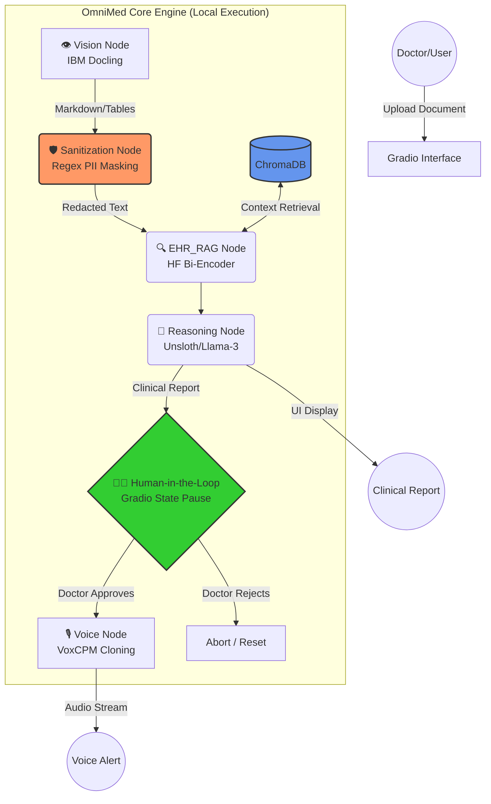
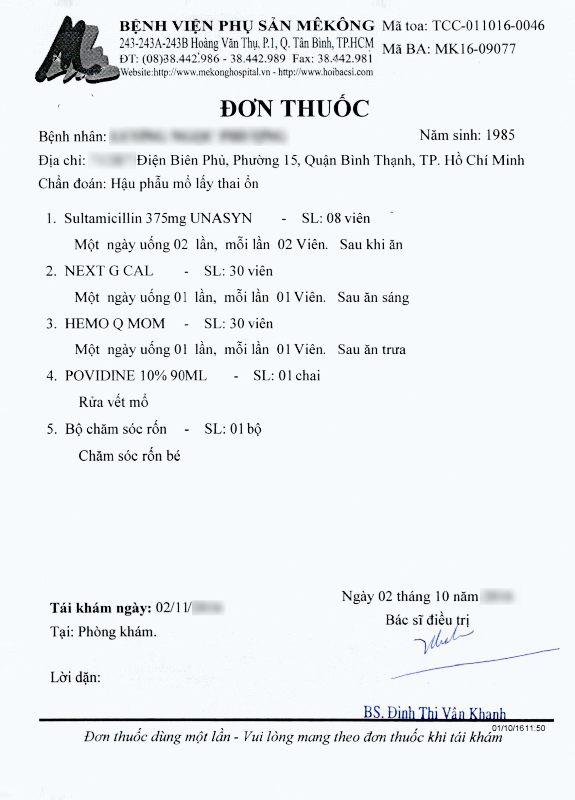

# 🏥 OmniMed-Agent-OS

<div align="center">
  
  
  
  
  
  
</div>

<br>

> **An Edge-Deployed, Deterministic Agentic Workflow for Medical Document Analysis & Voice Synthesis.**
> Engineered to run 4 heavyweight ML models (OCR, Embedding, LLM, TTS) sequentially on a **single constrained 16GB VRAM GPU** without Out-Of-Memory (OOM) crashes.

## 📌 Executive Summary
**OmniMed-Agent-OS** is not just an LLM wrapper; it is a state-driven Agentic ecosystem. It is designed to process noisy medical documents (receipts, prescriptions), reason over a localized medical RAG database, and synthesize zero-shot voice alerts. 

Built for healthcare compliance, it operates **100% locally** (Zero-API approach), ensuring Protected Health Information (PHI) never leaves the host machine.

## 🏗️ Core Architecture (State-Driven Workflow)
The system is orchestrated using **LangGraph**, utilizing a deterministic `MedicalState` graph to pass context safely between tools.


## 🔥 Enterprise Engineering Highlights (Why this Repo stands out)
* **VRAM Singleton Pattern:** Orchestrating multiple ML models usually causes OOM on consumer GPUs. I implemented strict Singleton caching and `try...finally` memory release (`torch.cuda.empty_cache()`) to guarantee stable sequential execution.
<kbd></kbd>
*Proof of VRAM Management: Dynamically unloading the 8B LLM to allocate memory for the TTS engine.*

* **Thread-Safe Human-in-the-Loop (HITL):** Built programmatic LangGraph checkpointer pauses. In the Gradio UI, the AI halts execution, displays the report, and uses `Session UUIDs` to wait for a Doctor's approval before resuming the graph to synthesize audio.

* **Anti-Hallucination Prompting:** Strict output templates and Few-Shot Negative Prompting are enforced to prevent small models (8B) from inventing fake medical prices or dropping Vietnamese diacritics.
<kbd></kbd>
*Left: Raw OCR with missing diacritics. Right: AI strictly following instructions to output "Không có thông tin" instead of hallucinating prices.*

* **Mock-Driven CI/CD Pipelines:** Deep learning libraries (Torch, Triton, Xformers) break standard CI runners. I engineered a robust `pytest` suite with `unittest.mock` to bypass C++ library dependencies, achieving lightning-fast, green CI/CD builds on GitHub Actions.
<kbd></kbd>
*Automated Pytest Execution: Mocking heavy ML models to achieve fast and reliable CI/CD test runs.*

* **Observability over Print:** Completely eradicated `print()` statements in favor of Python's standard `logging` module with traceback (`exc_info=True`) for production-grade monitoring.
## 🎯 Expected Output & Demo

<div align="center">
  
  <br><i>Input: Raw, unstandardized medical receipt</i>
  <video width="800" controls="controls" alt="OmniMed Gradio UI Demo" src="https://github.com/user-attachments/assets/483fdc3a-6fa8-44b2-a287-a656af702bd1">
  <br><i>Real-time execution: LangGraph Agent pausing for Human-in-the-Loop approval before generating VoxCPM Voice Alerts.</i>
</div>


**Generated Clinical Report (Raw Output from 8B 4-bit Quantized Model):**
```text
==================================================
📋 [PENDING DOCTOR APPROVAL] CLINICAL REPORT:
==================================================
Danh sách các mặt hàng/dịch vụ:

1. Sultamicillin (375mg, UNASYN) - 08 viên
2. NEXTGCAL - 30 viên
3. HEMOQMOM - 30 viên
4. Povidine (10%, 90ML) - 01 chai
5. Bocham soc ron - 01 bo

Tổng số tiền phải thanh toán: Không có thông tin

==================================================

==================================================
🔊 FINAL VOICE SUMMARY (TTS)
==================================================
Phân tích hoàn tất. Có năm loại thuốc. Bác sĩ vui lòng xem chi tiết trên màn hình.
```

---

## 🛠️ Quick Start Guide
### Option 1: One-Click Docker Deployment (Recommended)
Fully containerized to bypass Python dependency conflicts. Requires NVIDIA Container Toolkit.

```bash
git clone https://github.com/cantricao/OmniMed-Agent-OS.git
cd OmniMed-Agent-OS
docker-compose up -d --build

```

👉 Access the web interface at: **http://localhost:7860**

*Note: The first run may take a few minutes to download the base image and AI model weights. Subsequent runs will be instantaneous.*

### Option 2: Manual Local Setup

**1. Environment Setup:**
```bash
chmod +x setup.sh
./setup.sh
```

**2. Data Ingestion (Vector Database):**
Automatically fetches the `ViHealthQA` dataset and performs memory-safe batch embedding.
```bash
python src/core/ingest_real_data.py
```

**3. Run Unit Tests:**
```bash
pytest tests/
```

**4. Launch the Application:**
```bash
python app.py
```
*(For Headless/CI environments, use: AUTO_APPROVE=true python -m src.main_workflow)*

---

## ⚠️ Known Limitations & Future Work
Building edge-deployed AI on constrained hardware (16GB VRAM) requires trade-offs. Current known limitations include:
* **Quantization Loss:** The LLM reasoning engine uses a 4-bit quantized 8B model (`unsloth/llama-3-8b-Instruct-bnb-4bit`) to fit into memory alongside the TTS and Vision models. This aggressive quantization slightly degrades the model's ability to strictly follow Few-Shot Orthography prompts in Vietnamese (e.g., failing to correct "Bocham soc ron" to "Bộ chăm sóc rốn").
* **Future Solution:** In a true production environment with higher VRAM capacity (e.g., 2x A100), swapping the 8B model for a larger 70B parameter model, or adding a deterministic Python Regex/Dictionary pre-processing layer before the LLM, would resolve these edge-case spelling artifacts.

---

👨‍💻 About the Author
----------------------

**Tri Cao Can** AI Engineer & Data Analyst | Biomedical Data Science Specialist

Bridging the gap between cutting-edge Machine Learning architectures and strict healthcare compliance. I hold a Master of Data Analytics (Biomedical Data Analytics specialization) from the Queensland University of Technology (QUT).

I specialize in building end-to-end data pipelines, optimizing local LLM deployments (Unsloth/vLLM), and orchestrating Agentic AI systems for real-world enterprise environments.

* **📫 Actively seeking Data Scientist, ML Engineer, or Data Engineer roles**. Let's connect!

* **LinkedIn:** [linkedin.com/in/cao-tri-can](https://www.linkedin.com/in/cao-tri-can-08188b21b/)
* **Portfolio:** [Notion Portfolio](https://cumbersome-tachometer-03f.notion.site/)
* **Email:** cantricao@gmail.com
